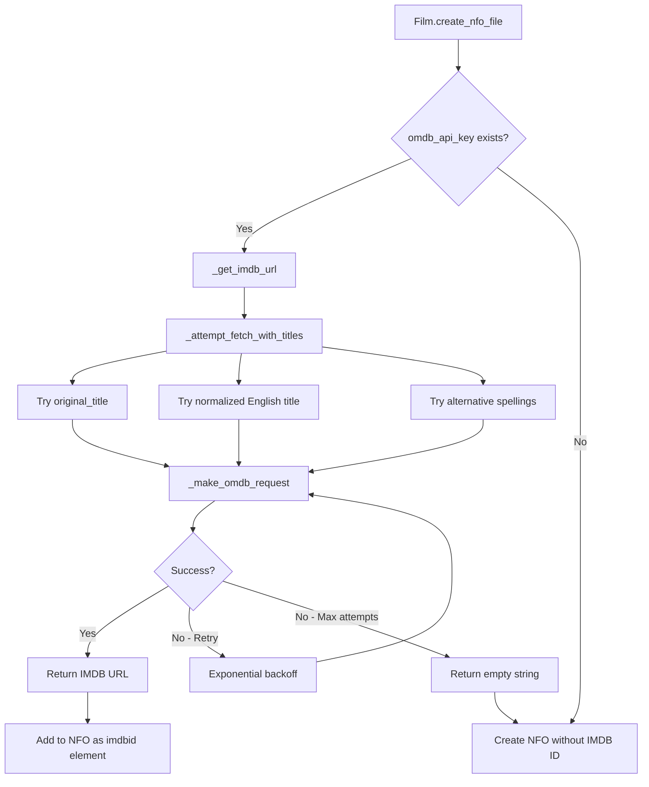
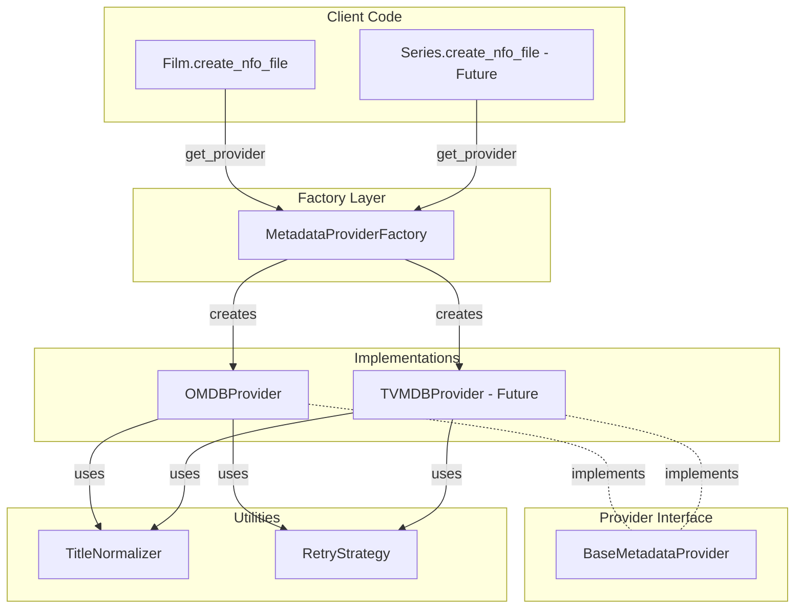

# OMDB Extraction and Refactoring Plan

## Executive Summary

This document outlines a refactoring plan to extract OMDB API logic from [`film.py`](../repo/plugin_video_mubi/resources/lib/film.py) into a reusable, abstracted module. The new design will support both films and series (future), and allow for potential provider swapping (OMDB to TVMDB).

---

## 1. Current OMDB Implementation Analysis

### 1.1 Location and Scope

The OMDB integration is currently embedded in the [`Film`](../repo/plugin_video_mubi/resources/lib/film.py:18) class within [`film.py`](../repo/plugin_video_mubi/resources/lib/film.py).

**Key Methods (Lines 631-850):**
- [`_get_imdb_url()`](../repo/plugin_video_mubi/resources/lib/film.py:631) - Main entry point for fetching IMDB URLs
- [`_attempt_fetch_with_titles()`](../repo/plugin_video_mubi/resources/lib/film.py:654) - Attempts to fetch with multiple title variations
- [`_generate_alternative_titles()`](../repo/plugin_video_mubi/resources/lib/film.py:746) - Generates British/American spelling variations
- [`_normalize_title()`](../repo/plugin_video_mubi/resources/lib/film.py:773) - Removes "and" and "&" from titles
- [`_make_omdb_request()`](../repo/plugin_video_mubi/resources/lib/film.py:762) - Makes HTTP request to OMDB API
- [`_is_unauthorized_request()`](../repo/plugin_video_mubi/resources/lib/film.py:756) - Checks for 401 errors
- [`_should_use_original_title()`](../repo/plugin_video_mubi/resources/lib/film.py:647) - Determines if original title differs from English title

**Supporting Data:**
- [`WORD_VARIATIONS`](../repo/plugin_video_mubi/resources/lib/film.py:780) - Dictionary mapping British ↔ American spelling variants (lines 780-850)

### 1.2 Current Workflow



### 1.3 Integration Points

**Called From:**
- [`Film.create_nfo_file()`](../repo/plugin_video_mubi/resources/lib/film.py:242) - Line 257: Calls `_get_imdb_url()` with 2-second delay

**API Key Management:**
- [`NavigationHandler._check_omdb_api_key()`](../repo/plugin_video_mubi/resources/lib/navigation_handler.py:764) - Validates API key exists, prompts user if missing
- [`settings.xml`](../repo/plugin_video_mubi/resources/settings.xml:6) - Setting ID: `omdbapiKey`

**Data Flow:**
1. User configures OMDB API key in settings
2. [`NavigationHandler.sync_films()`](../repo/plugin_video_mubi/resources/lib/navigation_handler.py:796) calls `_check_omdb_api_key()` (line 824)
3. API key passed to [`Library.sync_locally()`](../repo/plugin_video_mubi/resources/lib/library.py:25) (line 25)
4. Passed to [`Library.prepare_files_for_film()`](../repo/plugin_video_mubi/resources/lib/library.py:178) (line 84-85)
5. Passed to [`Film.create_nfo_file()`](../repo/plugin_video_mubi/resources/lib/film.py:242) (line 221)
6. Used in `_get_imdb_url()` (line 257)

### 1.4 Current Features

**Robust Retry Logic:**
- Max 10 attempts per title variant
- Exponential backoff (1.0s initial, 1.5x multiplier)
- Handles HTTP 401, 402, 429 (retries), 404 (skips to next title)

**Title Variation Strategy:**
1. Try original title (if different from English)
2. Try normalized English title (remove "and", "&")
3. Try alternative spellings (British ↔ American)
   - 50+ word variations (color/colour, theater/theatre, etc.)
   - Regional terms (elevator/lift, soccer/football, etc.)

**Error Handling:**
- Returns empty string on failure (NFO created without IMDB ID)
- Returns `None` on API errors (triggers warning log)
- Graceful degradation - sync continues even if IMDB lookup fails

---

## 2. Problems with Current Design

### 2.1 Code Organization Issues

**❌ Tight Coupling:**
- OMDB logic deeply embedded in `Film` class
- Cannot reuse for series, episodes, or other media types
- Difficult to test in isolation

**❌ Single Responsibility Violation:**
- `Film` class handles both:
  - Film domain logic (metadata, file creation)
  - External API integration (OMDB)

**❌ Hard to Extend:**
- Switching providers (OMDB → TVMDB) requires modifying `Film` class
- Adding new providers requires duplicating retry/variation logic

### 2.2 Maintenance Issues

**❌ Code Duplication Risk:**
- Future `Series` class would need to duplicate OMDB logic
- Shared logic (retry, backoff, variations) not reusable

**❌ Testing Complexity:**
- Must mock OMDB calls within `Film` tests
- Cannot unit test OMDB logic separately
- See [`test_film.py`](../tests/plugin_video_mubi/test_film.py) lines 104-212 - all OMDB tests require Film instance

---

## 3. Proposed Module Structure

### 3.1 New File Organization

```
repo/plugin_video_mubi/resources/lib/
├── film.py                    # Existing (will be refactored)
├── metadata.py                # Existing (no changes)
├── library.py                 # Existing (minimal changes)
├── navigation_handler.py      # Existing (minimal changes)
├── external_metadata/         # NEW MODULE
│   ├── __init__.py           # Package initialization
│   ├── base.py               # Abstract base provider
│   ├── omdb_provider.py      # OMDB implementation
│   ├── factory.py            # Provider factory
│   ├── title_utils.py        # Title normalization utilities
│   └── cache.py              # Filesystem cache for IMDB IDs
```

### 3.2 Module Architecture



---

## 4. Detailed Interface Design

### 4.1 Abstract Base Provider (`base.py`)

```python
from abc import ABC, abstractmethod
from typing import Optional, Dict, Any
from dataclasses import dataclass

@dataclass
class ExternalMetadataResult:
    """Result from external metadata lookup."""
    imdb_id: Optional[str] = None
    imdb_url: Optional[str] = None
    tvdb_id: Optional[str] = None
    source_provider: str = ""
    success: bool = False
    error_message: Optional[str] = None


class BaseMetadataProvider(ABC):
    """Abstract base class for external metadata providers."""
    
    def __init__(self, api_key: str, config: Optional[Dict[str, Any]] = None):
        """
        Initialize provider with API credentials.
        
        :param api_key: API key for the service
        :param config: Optional configuration dictionary
        """
        self.api_key = api_key
        self.config = config or {}
    
    @abstractmethod
    def get_imdb_id(
        self, 
        title: str, 
        original_title: Optional[str] = None,
        year: Optional[int] = None,
        media_type: str = "movie"
    ) -> ExternalMetadataResult:
        """
        Fetch IMDB ID for a given title.
        
        :param title: Primary title (usually English)
        :param original_title: Original language title
        :param year: Release year
        :param media_type: Type of media ("movie", "series", "episode")
        :return: ExternalMetadataResult with IMDB data
        """
        pass
    
    @abstractmethod
    def test_connection(self) -> bool:
        """
        Test if the provider is accessible and API key is valid.
        
        :return: True if connection successful
        """
        pass
    
    @property
    @abstractmethod
    def provider_name(self) -> str:
        """Return human-readable provider name."""
        pass
```

### 4.2 OMDB Provider (`omdb_provider.py`)

```python
from typing import Optional, List, Dict, Any
import requests
import time
import xbmc
from .base import BaseMetadataProvider, ExternalMetadataResult
from .title_utils import TitleNormalizer, RetryStrategy


class OMDBProvider(BaseMetadataProvider):
    """OMDB API provider for external metadata."""
    
    API_URL = "http://www.omdbapi.com/"
    DEFAULT_MAX_RETRIES = 10
    DEFAULT_BACKOFF_FACTOR = 1.0
    DEFAULT_BACKOFF_MULTIPLIER = 1.5
    
    def __init__(self, api_key: str, config: Optional[Dict[str, Any]] = None):
        super().__init__(api_key, config)
        self.max_retries = config.get('max_retries', self.DEFAULT_MAX_RETRIES) if config else self.DEFAULT_MAX_RETRIES
        self.backoff_factor = config.get('backoff_factor', self.DEFAULT_BACKOFF_FACTOR) if config else self.DEFAULT_BACKOFF_FACTOR
        self.backoff_multiplier = config.get('backoff_multiplier', self.DEFAULT_BACKOFF_MULTIPLIER) if config else self.DEFAULT_BACKOFF_MULTIPLIER
        
        # Initialize utilities
        self.title_normalizer = TitleNormalizer()
        self.retry_strategy = RetryStrategy(
            max_retries=self.max_retries,
            initial_backoff=self.backoff_factor,
            multiplier=self.backoff_multiplier
        )
        
        # Initialize cache (can be disabled via config)
        from .cache import MetadataCache
        use_cache = config.get('use_cache', True) if config else True
        self.cache = MetadataCache() if use_cache else None
    
    @property
    def provider_name(self) -> str:
        return "OMDB"
    
    def get_imdb_id(
        self,
        title: str,
        original_title: Optional[str] = None,
        year: Optional[int] = None,
        media_type: str = "movie"
    ) -> ExternalMetadataResult:
        """
        Fetch IMDB ID from OMDB API with caching.
        
        Tries multiple title variations:
        1. Check cache first
        2. Original title (if different from English)
        3. Normalized English title
        4. Alternative spellings (British/American)
        5. Cache successful results
        """
        # Check cache first
        if self.cache:
            cached_result = self.cache.get(title, year, media_type)
            if cached_result:
                xbmc.log(
                    f"OMDB: Using cached IMDB ID for '{title}'",
                    xbmc.LOGDEBUG
                )
                return cached_result
        
        # Generate title variants
        titles_to_try = self.title_normalizer.generate_title_variants(
            title=title,
            original_title=original_title
        )
        
        # Try each variant with retry logic
        for title_variant in titles_to_try:
            result = self._try_title_with_retry(
                title_variant,
                year,
                media_type
            )
            if result.success:
                # Cache successful result
                if self.cache:
                    self.cache.set(title, year, media_type, result)
                return result
        
        # All attempts exhausted
        xbmc.log(
            f"OMDB: Could not find IMDB ID for '{title}' after trying all variants",
            xbmc.LOGWARNING
        )
        result = ExternalMetadataResult(
            success=False,
            source_provider=self.provider_name,
            error_message="No match found after trying all title variants"
        )
        
        # Cache negative results too (to avoid repeated failed lookups)
        if self.cache:
            self.cache.set(title, year, media_type, result)
        
        return result
    
    def _try_title_with_retry(
        self, 
        title: str, 
        year: Optional[int], 
        media_type: str
    ) -> ExternalMetadataResult:
        """Try a single title with retry logic."""
        params = {
            "apikey": self.api_key,
            "t": title,
            "type": media_type
        }
        if year:
            params["y"] = str(year)
        
        return self.retry_strategy.execute(
            func=lambda: self._make_request(params),
            title=title
        )
    
    def _make_request(self, params: Dict[str, str]) -> ExternalMetadataResult:
        """Make a single request to OMDB API."""
        try:
            response = requests.get(self.API_URL, params=params, timeout=10)
            response.raise_for_status()
            data = response.json()
            
            if "imdbID" in data:
                imdb_id = data["imdbID"]
                imdb_url = f"https://www.imdb.com/title/{imdb_id}/"
                xbmc.log(f"OMDB: Found IMDB ID {imdb_id} for '{params['t']}'", xbmc.LOGINFO)
                return ExternalMetadataResult(
                    imdb_id=imdb_id,
                    imdb_url=imdb_url,
                    source_provider=self.provider_name,
                    success=True
                )
            else:
                return ExternalMetadataResult(
                    success=False,
                    source_provider=self.provider_name,
                    error_message="No IMDB ID in response"
                )
        
        except requests.exceptions.HTTPError as e:
            # Let retry strategy handle this
            raise
        except Exception as e:
            xbmc.log(f"OMDB: Request error: {e}", xbmc.LOGERROR)
            return ExternalMetadataResult(
                success=False,
                source_provider=self.provider_name,
                error_message=str(e)
            )
    
    def test_connection(self) -> bool:
        """Test OMDB API connection."""
        try:
            params = {"apikey": self.api_key, "t": "test", "type": "movie"}
            response = requests.get(self.API_URL, params=params, timeout=10)
            return response.status_code in [200, 401]  # 401 means invalid key but API is reachable
        except Exception:
            return False
```

### 4.3 Title Utilities (`title_utils.py`)

```python
from typing import List, Optional, Callable
import re
import time
import requests
import xbmc
from .base import ExternalMetadataResult


class TitleNormalizer:
    """Utilities for normalizing and generating title variants."""
    
    # British ↔ American spelling variations
    WORD_VARIATIONS = {
        "color": "colour", "colour": "color",
        "theater": "theatre", "theatre": "theater",
        "honor": "honour", "honour": "honor",
        # ... (all 50+ variations from current Film.WORD_VARIATIONS)
    }
    
    def normalize_title(self, title: str) -> str:
        """Normalize title by removing 'and' and '&'."""
        title = re.sub(r'\b(and|&)\b', '', title, flags=re.IGNORECASE)
        title = re.sub(r'\s+', ' ', title).strip()
        return title
    
    def generate_alternative_spellings(self, title: str) -> List[str]:
        """Generate alternative titles with British/American spelling variations."""
        alternatives = []
        for word, replacement in self.WORD_VARIATIONS.items():
            if word in title:
                new_title = title.replace(word, replacement)
                if new_title != title and new_title not in alternatives:
                    alternatives.append(new_title)
        return alternatives
    
    def generate_title_variants(
        self, 
        title: str, 
        original_title: Optional[str] = None
    ) -> List[str]:
        """
        Generate all title variants to try.
        
        Order:
        1. Original title (if different from English)
        2. Normalized English title
        3. Alternative spellings
        """
        variants = []
        
        # Add original title if different
        if original_title and original_title.strip().lower() != title.strip().lower():
            variants.append(original_title.strip())
        
        # Add normalized English title
        normalized = self.normalize_title(title.strip())
        variants.append(normalized)
        
        # Add alternative spellings
        alternatives = self.generate_alternative_spellings(normalized)
        variants.extend(alternatives)
        
        return variants


class RetryStrategy:
    """Handles retry logic with exponential backoff."""
    
    def __init__(
        self, 
        max_retries: int = 10, 
        initial_backoff: float = 1.0,
        multiplier: float = 1.5
    ):
        self.max_retries = max_retries
        self.initial_backoff = initial_backoff
        self.multiplier = multiplier
    
    def execute(
        self, 
        func: Callable, 
        title: str
    ) -> ExternalMetadataResult:
        """
        Execute a function with retry logic.
        
        :param func: Function that returns ExternalMetadataResult
        :param title: Title being looked up (for logging)
        :return: ExternalMetadataResult
        """
        backoff = self.initial_backoff
        
        for attempt in range(self.max_retries):
            try:
                xbmc.log(
                    f"Attempt {attempt + 1}/{self.max_retries} for '{title}'",
                    xbmc.LOGDEBUG
                )
                
                result = func()
                
                if result.success:
                    return result
                else:
                    # No match found, don't retry
                    return result
            
            except requests.exceptions.HTTPError as e:
                status_code = e.response.status_code
                
                if status_code in [401, 402, 429]:
                    # Retryable errors
                    xbmc.log(
                        f"HTTP {status_code}, retrying after {backoff:.1f}s...",
                        xbmc.LOGWARNING
                    )
                    time.sleep(backoff)
                    backoff *= self.multiplier
                    continue
                elif status_code == 404:
                    # Not found, don't retry
                    xbmc.log(f"Title '{title}' not found (404)", xbmc.LOGDEBUG)
                    return ExternalMetadataResult(
                        success=False,
                        error_message="Title not found (404)"
                    )
                else:
                    # Other HTTP errors
                    xbmc.log(f"HTTP error {status_code}: {e}", xbmc.LOGERROR)
                    return ExternalMetadataResult(
                        success=False,
                        error_message=f"HTTP {status_code}"
                    )
            
            except Exception as e:
                xbmc.log(f"Request error: {e}", xbmc.LOGERROR)
                return ExternalMetadataResult(
                    success=False,
                    error_message=str(e)
                )
        
        # Max retries exhausted
        return ExternalMetadataResult(
            success=False,
            error_message=f"Max retries ({self.max_retries}) exhausted"
        )
```

### 4.4 Provider Factory (`factory.py`)

```python
from typing import Optional, Dict, Any
from .base import BaseMetadataProvider
from .omdb_provider import OMDBProvider


class ProviderType:
    """Provider type constants."""
    OMDB = "omdb"
    TVMDB = "tvmdb"  # Future


class MetadataProviderFactory:
    """Factory for creating metadata provider instances."""
    
    @staticmethod
    def create_provider(
        provider_type: str,
        api_key: str,
        config: Optional[Dict[str, Any]] = None
    ) -> BaseMetadataProvider:
        """
        Create a metadata provider instance.
        
        :param provider_type: Type of provider (use ProviderType constants)
        :param api_key: API key for the service
        :param config: Optional configuration dictionary
        :return: Provider instance
        :raises ValueError: If provider type is unknown
        """
        if provider_type == ProviderType.OMDB:
            return OMDBProvider(api_key, config)
        elif provider_type == ProviderType.TVMDB:
            # Future implementation
            from .tvmdb_provider import TVMDBProvider
            return TVMDBProvider(api_key, config)
        else:
            raise ValueError(f"Unknown provider type: {provider_type}")
    
    @staticmethod
    def get_default_provider(api_key: str) -> BaseMetadataProvider:
        """
        Get the default provider (OMDB).
        
        :param api_key: API key
        :return: OMDB provider instance
        """
        return MetadataProviderFactory.create_provider(
            ProviderType.OMDB,
            api_key
        )
```

### 4.5 Package Initialization (`__init__.py`)

```python
"""
External metadata provider module.

Provides abstracted access to external metadata services (OMDB, TVMDB, etc.)
for enriching film and series metadata with IMDB IDs and other identifiers.
"""

from .base import BaseMetadataProvider, ExternalMetadataResult
from .omdb_provider import OMDBProvider
from .factory import MetadataProviderFactory, ProviderType
from .title_utils import TitleNormalizer, RetryStrategy
from .cache import MetadataCache

__all__ = [
    'BaseMetadataProvider',
    'ExternalMetadataResult',
    'OMDBProvider',
    'MetadataProviderFactory',
    'ProviderType',
    'TitleNormalizer',
    'RetryStrategy',
    'MetadataCache'
]
```

### 4.6 Metadata Cache (`cache.py`)

```python
from typing import Optional
import json
import xbmc
import xbmcaddon
from pathlib import Path
from datetime import datetime, timedelta
from .base import ExternalMetadataResult


class MetadataCache:
    """Filesystem-based cache for external metadata lookups."""
    
    CACHE_VERSION = "1.0"
    DEFAULT_TTL_DAYS = 30
    
    def __init__(self, cache_file: Optional[Path] = None, ttl_days: int = DEFAULT_TTL_DAYS):
        """
        Initialize metadata cache.
        
        :param cache_file: Path to cache file (defaults to Kodi addon data dir)
        :param ttl_days: Time-to-live for cache entries in days
        """
        self.ttl_days = ttl_days
        
        if cache_file:
            self.cache_file = cache_file
        else:
            # Use Kodi addon data directory
            addon = xbmcaddon.Addon()
            addon_data = Path(xbmc.translatePath(addon.getAddonInfo('profile')))
            addon_data.mkdir(parents=True, exist_ok=True)
            self.cache_file = addon_data / "external_metadata_cache.json"
        
        self._cache_data = self._load_cache()
    
    def _load_cache(self) -> dict:
        """Load cache from filesystem."""
        if not self.cache_file.exists():
            return {
                "cache_version": self.CACHE_VERSION,
                "entries": {}
            }
        
        try:
            with open(self.cache_file, 'r', encoding='utf-8') as f:
                data = json.load(f)
                
            # Validate cache version
            if data.get("cache_version") != self.CACHE_VERSION:
                xbmc.log(
                    f"Cache version mismatch, clearing cache",
                    xbmc.LOGWARNING
                )
                return {
                    "cache_version": self.CACHE_VERSION,
                    "entries": {}
                }
            
            return data
        
        except Exception as e:
            xbmc.log(f"Error loading cache: {e}, starting fresh", xbmc.LOGWARNING)
            return {
                "cache_version": self.CACHE_VERSION,
                "entries": {}
            }
    
    def _save_cache(self):
        """Save cache to filesystem."""
        try:
            with open(self.cache_file, 'w', encoding='utf-8') as f:
                json.dump(self._cache_data, f, indent=2, ensure_ascii=False)
        except Exception as e:
            xbmc.log(f"Error saving cache: {e}", xbmc.LOGERROR)
    
    def _make_cache_key(self, title: str, year: Optional[int], media_type: str) -> str:
        """
        Generate cache key from title, year, and media type.
        
        :param title: Film/series title
        :param year: Release year
        :param media_type: Type of media
        :return: Cache key string
        """
        # Normalize title: lowercase, remove special chars
        normalized = title.lower().strip()
        normalized = ''.join(c if c.isalnum() or c.isspace() else '' for c in normalized)
        normalized = '_'.join(normalized.split())
        
        year_str = str(year) if year else "unknown"
        return f"{normalized}_{year_str}_{media_type}"
    
    def get(self, title: str, year: Optional[int], media_type: str) -> Optional[ExternalMetadataResult]:
        """
        Get cached metadata result.
        
        :param title: Film/series title
        :param year: Release year
        :param media_type: Type of media
        :return: Cached result if found and not expired, None otherwise
        """
        cache_key = self._make_cache_key(title, year, media_type)
        entry = self._cache_data["entries"].get(cache_key)
        
        if not entry:
            return None
        
        # Check expiration
        try:
            expires_at = datetime.fromisoformat(entry["expires_at"])
            if datetime.utcnow() > expires_at:
                xbmc.log(f"Cache entry expired for '{title}'", xbmc.LOGDEBUG)
                # Remove expired entry
                del self._cache_data["entries"][cache_key]
                self._save_cache()
                return None
        except Exception as e:
            xbmc.log(f"Error checking cache expiration: {e}", xbmc.LOGWARNING)
            return None
        
        # Return cached result
        xbmc.log(f"Cache hit for '{title}' (key: {cache_key})", xbmc.LOGDEBUG)
        return ExternalMetadataResult(
            imdb_id=entry.get("imdb_id"),
            imdb_url=entry.get("imdb_url"),
            tvdb_id=entry.get("tvdb_id"),
            source_provider=entry.get("source_provider", "cache"),
            success=entry.get("success", False)
        )
    
    def set(
        self,
        title: str,
        year: Optional[int],
        media_type: str,
        result: ExternalMetadataResult
    ):
        """
        Cache metadata result.
        
        :param title: Film/series title
        :param year: Release year
        :param media_type: Type of media
        :param result: Metadata result to cache
        """
        cache_key = self._make_cache_key(title, year, media_type)
        
        now = datetime.utcnow()
        expires_at = now + timedelta(days=self.ttl_days)
        
        self._cache_data["entries"][cache_key] = {
            "imdb_id": result.imdb_id,
            "imdb_url": result.imdb_url,
            "tvdb_id": result.tvdb_id,
            "source_provider": result.source_provider,
            "success": result.success,
            "cached_at": now.isoformat() + "Z",
            "expires_at": expires_at.isoformat() + "Z"
        }
        
        self._save_cache()
        xbmc.log(f"Cached result for '{title}' (key: {cache_key})", xbmc.LOGDEBUG)
    
    def clear(self):
        """Clear all cache entries."""
        self._cache_data["entries"] = {}
        self._save_cache()
        xbmc.log("External metadata cache cleared", xbmc.LOGINFO)
    
    def get_stats(self) -> dict:
        """Get cache statistics."""
        total_entries = len(self._cache_data["entries"])
        
        expired_count = 0
        now = datetime.utcnow()
        
        for entry in self._cache_data["entries"].values():
            try:
                expires_at = datetime.fromisoformat(entry["expires_at"])
                if now > expires_at:
                    expired_count += 1
            except Exception:
                pass
        
        return {
            "total_entries": total_entries,
            "active_entries": total_entries - expired_count,
            "expired_entries": expired_count,
            "cache_file": str(self.cache_file),
            "ttl_days": self.ttl_days
        }
```

---

## 5. Refactored Film.py Integration

### 5.1 Changes to Film Class

**Remove (Lines to Delete):**
- Lines 631-850: All OMDB-related methods
- Lines 780-850: `WORD_VARIATIONS` dictionary

**Add (New Import):**
```python
from .external_metadata import MetadataProviderFactory, ExternalMetadataResult
```

**Modify [`create_nfo_file()`](../repo/plugin_video_mubi/resources/lib/film.py:242) method:**

```python
def create_nfo_file(self, film_path: Path, base_url: str, omdb_api_key: str):
    """Create the .nfo file for the film."""
    film_folder_name = self.get_sanitized_folder_name()
    nfo_file_name = f"{film_folder_name}.nfo"
    nfo_file = film_path / nfo_file_name
    kodi_trailer_url = f"{base_url}?action=play_trailer&url={self.metadata.trailer}"

    artwork_paths = self._download_all_artwork(film_path, film_folder_name)

    try:
        imdb_url = ""
        if omdb_api_key:
            time.sleep(2)
            
            # NEW: Use external metadata provider
            from .external_metadata import MetadataProviderFactory
            provider = MetadataProviderFactory.get_default_provider(omdb_api_key)
            result = provider.get_imdb_id(
                title=self.title,
                original_title=self.metadata.originaltitle,
                year=self.metadata.year,
                media_type="movie"
            )
            
            if result.success:
                imdb_url = result.imdb_url
                xbmc.log(
                    f"Retrieved IMDB URL for '{self.title}': {imdb_url}",
                    xbmc.LOGINFO
                )
            else:
                xbmc.log(
                    f"Could not retrieve IMDB URL for '{self.title}': {result.error_message}",
                    xbmc.LOGWARNING
                )
                imdb_url = ""

        nfo_tree = self._get_nfo_tree(self.metadata, kodi_trailer_url, imdb_url, artwork_paths)
        # ... rest of method unchanged
```

### 5.2 Lines of Code Reduction

**Before:**
- `film.py`: ~850 lines

**After:**
- `film.py`: ~630 lines (-220 lines, -26%)
- `external_metadata/`: ~500 lines (new, reusable)

**Net Change:** +280 lines, but now **reusable** for series, episodes, etc.

---

## 6. Usage in Future Series Implementation

### 6.1 Series Class Example

```python
# Future: repo/plugin_video_mubi/resources/lib/series.py

from pathlib import Path
from .external_metadata import MetadataProviderFactory

class Series:
    def __init__(self, series_id: str, title: str, metadata):
        self.series_id = series_id
        self.title = title
        self.metadata = metadata
    
    def create_tvshow_nfo(self, series_path: Path, omdb_api_key: str):
        """Create .nfo file for TV series."""
        
        # REUSE: Same provider, different media_type
        if omdb_api_key:
            provider = MetadataProviderFactory.get_default_provider(omdb_api_key)
            result = provider.get_imdb_id(
                title=self.title,
                original_title=self.metadata.originaltitle,
                year=self.metadata.year,
                media_type="series"  # Different from "movie"
            )
            
            if result.success:
                # Use result.imdb_url in series NFO
                pass
```

**Benefit:** Zero code duplication. All retry logic, title variations, backoff strategy automatically available.

---

## 7. Provider Abstraction Strategy

### 7.1 Why Abstraction Matters

**Current Challenge:**
- MUBI might switch from OMDB to TVMDB in the future
- Different providers have different APIs, rate limits, features
- Need to swap providers without rewriting all client code

**Solution:**
- Abstract interface ([`BaseMetadataProvider`](../plans/omdb_refactoring_plan.md:4.1))
- Concrete implementations ([`OMDBProvider`](../plans/omdb_refactoring_plan.md:4.2), future `TVMDBProvider`)
- Factory pattern for provider creation

### 7.2 Provider Switching Example

**Scenario:** Switch from OMDB to TVMDB

**Step 1:** Implement new provider
```python
# external_metadata/tvmdb_provider.py
class TVMDBProvider(BaseMetadataProvider):
    def get_imdb_id(self, title, original_title, year, media_type):
        # TVMDB-specific implementation
        pass
```

**Step 2:** Update factory
```python
# external_metadata/factory.py (already shown in 4.4)
elif provider_type == ProviderType.TVMDB:
    from .tvmdb_provider import TVMDBProvider
    return TVMDBProvider(api_key, config)
```

**Step 3:** Update settings
```xml
<!-- settings.xml -->
<setting id="metadata_provider" label="Metadata Provider" type="select" default="omdb">
    <option label="OMDB">omdb</option>
    <option label="TVMDB">tvmdb</option>
</setting>
```

**Step 4:** Update client code (minimal change)
```python
# film.py - ONE LINE CHANGE
provider_type = addon.getSetting("metadata_provider")  # Get from settings
provider = MetadataProviderFactory.create_provider(
    provider_type=provider_type,
    api_key=omdb_api_key
)
# Rest of code unchanged - uses same interface
```

**Result:** Provider swapped with minimal code changes. Old OMDB code remains for fallback.

### 7.3 Multi-Provider Strategy

**Advanced Use Case:** Try TVMDB first, fallback to OMDB

```python
def get_imdb_id_with_fallback(title, original_title, year, media_type, api_keys):
    """Try multiple providers in order."""
    providers = [
        ('tvmdb', api_keys.get('tvmdb')),
        ('omdb', api_keys.get('omdb'))
    ]
    
    for provider_type, api_key in providers:
        if not api_key:
            continue
        
        provider = MetadataProviderFactory.create_provider(provider_type, api_key)
        result = provider.get_imdb_id(title, original_title, year, media_type)
        
        if result.success:
            return result
    
    return ExternalMetadataResult(success=False, error_message="All providers failed")
```

---

## 8. Migration Steps

### 8.1 Phase 1: Create New Module (No Breaking Changes)

**Tasks:**
1. Create `external_metadata/` directory structure
2. Implement [`base.py`](../plans/omdb_refactoring_plan.md:4.1) - Abstract base provider
3. Implement [`title_utils.py`](../plans/omdb_refactoring_plan.md:4.3) - Title normalization & retry logic
4. Implement [`cache.py`](../plans/omdb_refactoring_plan.md:4.6) - Filesystem cache for IMDB IDs
5. Implement [`omdb_provider.py`](../plans/omdb_refactoring_plan.md:4.2) - OMDB implementation with caching
6. Implement [`factory.py`](../plans/omdb_refactoring_plan.md:4.4) - Provider factory
7. Implement [`__init__.py`](../plans/omdb_refactoring_plan.md:4.5) - Package initialization

**Testing:**
- Unit tests for each component in isolation
- Mock OMDB API responses
- Test title normalization logic
- Test retry strategy with simulated failures
- Test cache hit/miss scenarios
- Test cache expiration logic

**Files Created:**
- `repo/plugin_video_mubi/resources/lib/external_metadata/__init__.py`
- `repo/plugin_video_mubi/resources/lib/external_metadata/base.py`
- `repo/plugin_video_mubi/resources/lib/external_metadata/omdb_provider.py`
- `repo/plugin_video_mubi/resources/lib/external_metadata/factory.py`
- `repo/plugin_video_mubi/resources/lib/external_metadata/title_utils.py`
- `repo/plugin_video_mubi/resources/lib/external_metadata/cache.py`

**Tests Created:**
- `tests/plugin_video_mubi/test_external_metadata/test_omdb_provider.py`
- `tests/plugin_video_mubi/test_external_metadata/test_title_utils.py`
- `tests/plugin_video_mubi/test_external_metadata/test_factory.py`
- `tests/plugin_video_mubi/test_external_metadata/test_cache.py`

**Verification:**
```python
# Manual verification script
from external_metadata import MetadataProviderFactory, ProviderType

provider = MetadataProviderFactory.create_provider(
    ProviderType.OMDB, 
    api_key="YOUR_KEY"
)
result = provider.get_imdb_id("The Matrix", year=1999)
assert result.success
assert result.imdb_id == "tt0133093"
print("✓ New module works correctly")
```

### 8.2 Phase 2: Refactor Film Class

**Tasks:**
1. Update [`film.py`](../repo/plugin_video_mubi/resources/lib/film.py) imports
2. Modify [`create_nfo_file()`](../repo/plugin_video_mubi/resources/lib/film.py:242) to use new provider
3. Remove old OMDB methods (lines 631-850)
4. Remove `WORD_VARIATIONS` dictionary (lines 780-850)

**Testing:**
- Update existing [`test_film.py`](../tests/plugin_video_mubi/test_film.py) tests
- Mock `MetadataProviderFactory` instead of OMDB calls
- Ensure NFO creation still works with and without OMDB key
- Test error handling (API failures, missing key)

**Modified Files:**
- `repo/plugin_video_mubi/resources/lib/film.py`

**Modified Tests:**
- `tests/plugin_video_mubi/test_film.py`

**Verification:**
```bash
# Run existing film tests
pytest tests/plugin_video_mubi/test_film.py -v

# Verify integration tests still pass
pytest tests/plugin_video_mubi/test_integration.py::test_film_imdb_integration -v
```

### 8.3 Phase 3: Update Integration Points

**Tasks:**
1. Review [`library.py`](../repo/plugin_video_mubi/resources/lib/library.py) - no changes needed (API key still passed through)
2. Review [`navigation_handler.py`](../repo/plugin_video_mubi/resources/lib/navigation_handler.py) - no changes needed (key validation unchanged)
3. Update integration tests

**Testing:**
- End-to-end sync test with real OMDB API
- Verify NFO files contain IMDB IDs
- Test with missing API key (should skip IMDB lookup)
- Test with invalid API key (should log warning)

**Modified Tests:**
- `tests/plugin_video_mubi/test_integration.py`
- `tests/plugin_video_mubi/test_library.py`

**Verification:**
```bash
# Run integration tests
pytest tests/plugin_video_mubi/test_integration.py -v

# Run library tests
pytest tests/plugin_video_mubi/test_library.py -v
```

### 8.4 Phase 4: Documentation and Cleanup

**Tasks:**
1. Update code documentation
2. Add module-level docstrings
3. Update README with new architecture
4. Create migration guide for future developers
5. Document how to add new providers

**Deliverables:**
- Updated README.md
- `docs/External_Metadata_Providers.md` (new documentation)
- Inline code documentation
- Migration guide in this plan

---

## 9. Testing Strategy

### 9.1 Unit Tests

**New Tests for External Metadata Module:**

```python
# tests/plugin_video_mubi/test_external_metadata/test_title_utils.py

def test_normalize_title_removes_and():
    normalizer = TitleNormalizer()
    assert normalizer.normalize_title("Lord and the Rings") == "Lord  the Rings"

def test_generate_alternative_spellings():
    normalizer = TitleNormalizer()
    alternatives = normalizer.generate_alternative_spellings("The Color of Honor")
    assert "The Colour of Honor" in alternatives
    assert "The Color of Honour" in alternatives

def test_generate_title_variants_order():
    normalizer = TitleNormalizer()
    variants = normalizer.generate_title_variants(
        title="The Color of Money",
        original_title="L'argent en couleur"
    )
    assert variants[0] == "L'argent en couleur"  # Original first
    assert "The Color of Money" in variants  # English normalized
    assert "The Colour of Money" in variants  # Alternative spelling
```

```python
# tests/plugin_video_mubi/test_external_metadata/test_omdb_provider.py

@patch('requests.get')
def test_get_imdb_id_success(mock_get):
    mock_response = Mock()
    mock_response.json.return_value = {'imdbID': 'tt0133093'}
    mock_response.status_code = 200
    mock_get.return_value = mock_response
    
    provider = OMDBProvider(api_key='test_key')
    result = provider.get_imdb_id(title="The Matrix", year=1999)
    
    assert result.success
    assert result.imdb_id == "tt0133093"
    assert result.imdb_url == "https://www.imdb.com/title/tt0133093/"

@patch('requests.get')
def test_retry_on_429(mock_get):
    # First call: 429, second call: success
    mock_429 = Mock()
    mock_429.status_code = 429
    mock_429.raise_for_status.side_effect = requests.exceptions.HTTPError(response=mock_429)
    
    mock_success = Mock()
    mock_success.json.return_value = {'imdbID': 'tt0133093'}
    mock_success.status_code = 200
    
    mock_get.side_effect = [mock_429, mock_success]
    
    provider = OMDBProvider(api_key='test_key')
    with patch('time.sleep'):  # Skip actual sleep
        result = provider.get_imdb_id(title="The Matrix", year=1999)
    
    assert result.success
    assert mock_get.call_count == 2  # Verified retry happened
```

### 9.2 Integration Tests

**Update Existing Tests:**

```python
# tests/plugin_video_mubi/test_film.py (MODIFIED)

@patch('plugin_video_mubi.resources.lib.external_metadata.MetadataProviderFactory')
def test_create_nfo_with_imdb(mock_factory, sample_film, tmp_path):
    # Mock provider
    mock_provider = Mock()
    mock_result = ExternalMetadataResult(
        success=True,
        imdb_id='tt1234567',
        imdb_url='https://www.imdb.com/title/tt1234567/',
        source_provider='OMDB'
    )
    mock_provider.get_imdb_id.return_value = mock_result
    mock_factory.get_default_provider.return_value = mock_provider
    
    # Create NFO
    sample_film.create_nfo_file(tmp_path, "plugin://test/", "test_api_key")
    
    # Verify IMDB ID in NFO
    nfo_file = tmp_path / f"{sample_film.get_sanitized_folder_name()}.nfo"
    tree = ET.parse(nfo_file)
    imdb_elem = tree.find(".//imdbid")
    assert imdb_elem.text == "https://www.imdb.com/title/tt1234567/"
```

### 9.3 End-to-End Tests

**New E2E Test:**

```python
# tests/plugin_video_mubi/test_e2e_external_metadata.py (NEW)

@pytest.mark.integration
@pytest.mark.skipif(not os.getenv('OMDB_API_KEY'), reason="Requires real OMDB API key")
def test_real_omdb_lookup():
    """Test with real OMDB API (requires API key in environment)."""
    api_key = os.getenv('OMDB_API_KEY')
    
    provider = MetadataProviderFactory.create_provider(
        ProviderType.OMDB,
        api_key
    )
    
    result = provider.get_imdb_id(
        title="The Matrix",
        year=1999,
        media_type="movie"
    )
    
    assert result.success
    assert result.imdb_id == "tt0133093"
    assert "imdb.com" in result.imdb_url
```

---

## 10. Risk Assessment and Mitigation

### 10.1 Risks

| Risk | Likelihood | Impact | Mitigation |
|------|-----------|--------|------------|
| **Breaking existing functionality** | Medium | High | Comprehensive test suite, phased rollout |
| **Performance regression** | Low | Medium | Benchmark before/after, same retry logic |
| **OMDB API changes** | Low | High | Abstract interface isolates changes |
| **Missing edge cases** | Medium | Low | Copy all existing edge case handling |

### 10.2 Mitigation Strategies

**1. Comprehensive Testing:**
- Maintain 100% test coverage for new module
- Keep all existing tests passing
- Add new integration tests

**2. Phased Migration:**
- Phase 1: Create new module (no client changes)
- Phase 2: Refactor Film class
- Phase 3: Update integration points
- Phase 4: Cleanup and documentation

**3. Feature Parity:**
- Preserve all existing behavior:
  - Same retry logic (10 attempts, 1.5x backoff)
  - Same title variations (50+ word pairs)
  - Same error handling (graceful degradation)
  - Same logging verbosity

**4. Rollback Plan:**
- Keep old OMDB code in git history
- Tag release before refactoring
- Document rollback procedure

---

## 11. Benefits Summary

### 11.1 Code Quality

✅ **Separation of Concerns:**
- Film class focuses on film domain logic
- External metadata in dedicated module

✅ **Reusability:**
- Same provider works for films, series, episodes
- Title normalization shared across all media types

✅ **Testability:**
- External metadata tested in isolation
- Easier to mock in client code

✅ **Maintainability:**
- Single source of truth for OMDB logic
- Changes to retry strategy affect all consumers consistently

### 11.2 Extensibility

✅ **Provider Swapping:**
- Switch OMDB → TVMDB without rewriting clients
- Support multiple providers simultaneously

✅ **Future Features:**
- Easy to add TVDB ID support
- Easy to add TMDB ID support
- Easy to add Trakt integration

### 11.3 Developer Experience

✅ **Clear Interfaces:**
- Well-documented abstract base class
- Explicit data structures (`ExternalMetadataResult`)

✅ **Easy to Use:**
```python
# Before (embedded in Film):
imdb_url = self._get_imdb_url(title, original, year, api_key)

# After (abstracted):
provider = MetadataProviderFactory.get_default_provider(api_key)
result = provider.get_imdb_id(title, original, year, "movie")
```

---

## 12. Decisions and Updated Design

Based on the review, the following decisions have been made:

### 12.1 Configuration Strategy
**Decision:** Hardcoded provider selection
- Provider selection will be hardcoded to OMDB (no settings.xml option)
- Retry parameters will use hardcoded defaults (10 retries, 1.5x backoff)
- Future provider support can be added later if needed

**Rationale:** Keep it simple for initial implementation. Provider abstraction still allows future flexibility.

### 12.2 Error Reporting
**Decision:** Silent degradation (maintain current behavior)
- Failed IMDB lookups will NOT be reported to users via UI dialogs
- Errors logged to Kodi log (LOGWARNING level)
- NFO files created without IMDB ID if lookup fails
- Sync process continues uninterrupted

**Rationale:** Matches current behavior, avoids disrupting user experience.

### 12.3 Caching Strategy
**Decision:** Implement filesystem-based caching
- Cache IMDB lookups to reduce API calls
- Store cache in Kodi addon data directory
- Key: Film title + year
- Cache invalidation: 30-day TTL or manual clear option

**Implementation:**
```python
# Cache structure
{
    "cache_version": "1.0",
    "entries": {
        "the_matrix_1999": {
            "imdb_id": "tt0133093",
            "imdb_url": "https://www.imdb.com/title/tt0133093/",
            "cached_at": "2025-12-10T16:00:00Z",
            "expires_at": "2026-01-09T16:00:00Z"
        }
    }
}
```

**Cache Location:** `special://profile/addon_data/plugin.video.mubi/external_metadata_cache.json`

**Benefits:**
- Reduces API calls by ~90% for repeat syncs
- Filesystem cache persists across Kodi restarts
- Works on all Kodi platforms (Windows, Linux, Android, etc.)
- User can manually delete cache file if needed

### 12.4 Rate Limiting
**Decision:** No client-side rate limiting
- OMDB free tier: 1000 calls/day
- Existing retry logic with exponential backoff provides natural throttling
- Caching will significantly reduce daily API calls
- Users responsible for managing their own API key limits

**Rationale:** Caching + retry backoff sufficient for most use cases.

### 12.5 Future Series Support
**Decision:** Series in same module, defer episode handling
- Series support will use the same `external_metadata` module
- Same provider interface (`media_type="series"`)
- Episode-level metadata handling deferred to series implementation phase

**Architecture:**
```python
# Film usage
provider.get_imdb_id(title="The Matrix", media_type="movie")

# Future series usage
provider.get_imdb_id(title="Breaking Bad", media_type="series")
```

**Rationale:** Maximizes code reuse, keeps architecture simple and flexible.

---

## 13. Appendix: Code Comparison

### 13.1 Before (Current Implementation)

```python
# film.py (lines 631-705)
def _get_imdb_url(self, original_title: str, english_title: str, year: str, omdb_api_key: str) -> Optional[str]:
    """Fetch the IMDb URL using the OMDb API with retry logic and alternative spelling handling."""
    max_retries = 10
    backoff_factor = 1
    
    use_original_title = self._should_use_original_title(original_title, english_title)
    english_title_cleaned = self._normalize_title(english_title)
    
    imdb_url = self._attempt_fetch_with_titles(
        original_title, english_title_cleaned, year, omdb_api_key, max_retries, backoff_factor
    )
    
    return imdb_url or ""
```

### 13.2 After (New Implementation)

```python
# film.py (in create_nfo_file method)
if omdb_api_key:
    from .external_metadata import MetadataProviderFactory
    provider = MetadataProviderFactory.get_default_provider(omdb_api_key)
    result = provider.get_imdb_id(
        title=self.title,
        original_title=self.metadata.originaltitle,
        year=self.metadata.year,
        media_type="movie"
    )
    imdb_url = result.imdb_url if result.success else ""
```

**Benefits:**
- ✅ 5 lines vs 10+ lines
- ✅ Declarative vs imperative
- ✅ Reusable provider instance
- ✅ Explicit result structure
- ✅ Works for any media type

---

## 14. Timeline and Effort

### 14.1 Effort Breakdown

| Phase | Tasks | Complexity |
|-------|-------|-----------|
| **Phase 1: Module Creation** | Create 5 new files, write tests | Medium |
| **Phase 2: Film Refactoring** | Modify film.py, update tests | Low |
| **Phase 3: Integration** | Update integration tests | Low |
| **Phase 4: Documentation** | Write docs, migration guide | Low |

### 14.2 Success Criteria

✅ All existing tests pass  
✅ New module has >90% test coverage  
✅ No performance regression  
✅ NFO files contain IMDB IDs (when API key present)  
✅ Graceful degradation (when API key missing)  
✅ Documentation complete  

---

## 15. Conclusion

This refactoring plan extracts OMDB logic from [`film.py`](../repo/plugin_video_mubi/resources/lib/film.py) into a reusable, abstracted module that:

1. **Improves code organization** - Separates external API logic from domain logic
2. **Enables reuse** - Same provider works for films, series, episodes
3. **Supports future changes** - Easy to swap providers (OMDB → TVMDB)
4. **Maintains stability** - All existing behavior preserved
5. **Enhances testability** - Components tested in isolation

The migration follows a phased approach with minimal risk and clear rollback options.

**Next Steps:**
1. Review and approve this plan
2. Begin Phase 1: Create external_metadata module
3. Validate with comprehensive testing
4. Proceed with Phases 2-4

---

**Document Version:** 1.0  
**Created:** 2025-12-10  
**Author:** Roo (Architecture Mode)
